# An introduction to CpH-Metadynamics simulations

## Aim

This tutorial aims to train users to perform CpH-Metadynamics simulations using the stochastic titration constant-pH Molecular Dynamics method and PLUMED. 

## Objectives

Upon completion of this tutorial users will be able to:
- Write and modify both the CpHMD.settings and PLUMED input file to perform CpH-MetaD simulations ;
- Calculate free energy as a function of the chosen collective variables and the pH of the simulation ;
- Unbias conformational and pH-dependent properties ; 
- Estimate the errors in average protonations and pKa estimates ;
- How to combine multiple CpH-MetaD simulations through binless WHAM procedure ;
- Calculate properties using the WHAM pH weights.

## Software Installation

We will need PLUMED 2.9.0, a GROMACS version 2023 patched with PLUMED and the CpHMD v3.0 for this tutorial. The first two softwares can be installed using the instructions found [here](https://github.com/plumed/cecam2023/blob/main/software.md). For the installation of the CpHMD v3.0, we recommend visiting the [GitHub page](https://github.com/NunoFBOliveira/CpHMD_v3/tree/main) of the CpHMD method by the Machuqueiro group and installing the AMBER version. Following that installation, visit the [CpH-Metadynamics page](https://github.com/Tomfersil/CpH-MetaD/tree/main) by Tomás F. D. Silva and follow the instructions on how to patch the CpHMD v3.0 for modified AMBER $\chi$ OL3 RNA parameters and the metadynamics compatibility using PLUMED. Please follow nad cite the relevant papers mentioned in the GitHub pages. 

## Resources

This tutorial contains the following files:
- .occ files: a type of file that contains protonation data;
- .pdb/.xtc: a reference pdb file and the trajectories necessary for the analysis;
- HILLS:  files that contain the accumulated bias for each pH simulation; 
- .dat: PLUMED input and output files required for analyses in the notebook.

Additionally, several scripts are available for preparation of trajectories and protonation files, to generate PLUMED input files and to obtain their respective output data.

## Introduction to CpH-Metadynamics

Constant pH Metadynamics is a methodological approach that integrates two main ideas: the [stochastic titration Constant pH Molecular Dynamics](https://doi.org/10.1063/1.1497164) method and the [metadynamics](https://doi.org/10.1038/s42254-020-0153-0) method. For a more detailed explanation of how both these methods work, we recommend a deeper dive into the provided links. However, here we will tackle the main rationale behind the [CpH-Metadynamics approach](https://arxiv.org/pdf/2410.16064) and to do that we will tackle the st-CpHMD first.

### st-CpHMD:

The [st-CpHMD method](https://doi.org/10.1063/1.1497164) and other CpHMD methods aim to introduce an additional parameter into MD simulations which is the pH. The introduction of the pH relates to the fact that the standard MD protocols assume fixed protonation states in their residues whereas, in biological conditions, residue titration is dependent on the pH and the surrounding environment. While there are many valid ways to integrate the chemical potential within MD, in this work we use a start-stop approach to change the protonation state along the simulation partitioned into three main steps:

- a Poisson-Boltzmann/Monte Carlo (PB/MC) step ;
- a solvent relaxation step ;
- a MD production step ;

in the PB/MC, protonation free energies are calculated in a single conformation to determine the likelihood of the different protonation states of a titrable site, which are then sampled through a MC procedure until it satisfies a criterion. Upon reassigning the protonation state, a short MD is run with restraints on the solute to allow the solvent to readjust to the new charges. Finally, there is the production MD step, typically 20 ps, which samples the conformational space. After this step, we reinitiate the cycle for how many times are necessary until we reach the desired simulation length. A deeper dive on how we can extract energies from protonation-dependent properties will be addressed on the analysis segment.This method effectively couples discrete protonation states and conformational sampling, thus allowing a more rich description of a biological system.

### Metadynamics integration:

In typical metadynamics simulations, specific degree of freedoms are selected as fundamental for a given biological system. Hence, we accelerate the conformational sampling of the system in function of those degree of freedom called collective variables (CV) by periodically building an history-dependent bias potential. This bias potential is generated by summing Gaussians along the simulation in the CV space. For more details, check the theory behind the [PLUMED tutorial](https://www.plumed.org/doc-v2.9/user-doc/html/advanced-methods.html) on metadynamics.

Effectively, certain degrees of freedom are more challenging to sample and can relate to important conformational properties of the system of interest. Furthermore, these degrees of freedom may be regulated by key pH-sensitive residues or certain conformational ensembles require major conformational transitions triggered by changes in the electrostatic environment. These slow degrees of freedom benefit from enhanced sampling techniques such as metadynamics but also from a CpHMD method that easily changes the protonation state of key residues. This is done by allowing the PLUMED module to be ran in the MD production step of the st-CpHMD method following a pre-defined PLUMED input file with chosen CVs. We will explore how to define these settings in the following section. By integrating PLUMED within the st-CpHMD methodology, we effectively improve the accuracy of average protonation and pKa calculations as the tutorial will show in later sections.

## Setting up a CpH-Metadynamics simulation

Setting up a CpH-Metadynamics simulation requires defining parameters for two sections: the CpHMD section and the PLUMED input file. Previous knowledge on [metadynamics](https://www.plumed.org/doc-v2.9/user-doc/html/advanced-methods.html) and/or CpHMD simulations is helpful.
Examine the CpHMD.settings file. For now, let's observe the main defining settings:

```
###  Start of CpHMD settings (pHmdp) ###
#
########################################
export SysName="A5mer" # Name of our protein or system
export Segments=100 # Number of MD/CpHMD Segments
export Seg_size=10 # Size of each Segment in nanoseconds
export ffDIR="/leonardo/home/userexternal/tfernand/Constant_pH/CpHMD_MetaD/top/XOL3pH.ff"
export ffID=XOL3pH #XOL3pH # Force fields: G54a7pH/CHARMM36pH  --> GROMOS 54a7/CHARMM 36m
export plumed=grid # Static - static potential after metaD ; grid - run metaD using grids instead of running Hills; yes - standard metaD using Hills
export water=opc # Water model used
export pH=XX.XX # Solution pH
export sites="9" # list of residues to titrate or "all" to titrate every residue
export temp=300.0 # Temperature (Kelvin)
export ionicstr=0.01 # Ionic Strength (moles/litre)

```

In this section, we need to define the number of segments and the size of each segment in nanoseconds. In the following exercise, we will manage 100 ns trajectories partitioned into 10 segments of 10 ns each. Another important input is the choice of force field. Popular force fields were specifically modified to incorporate multiple protonation tautomers for different biomolecules (see: [CpHMD-v3.0 Github page](https://github.com/NunoFBOliveira/CpHMD_v3/tree/main)). In this tutorial, we will be studying a uridine nucleobase, so we will use the XOL3pH ff (see the [XOL3pH parametrization](https://github.com/Tomfersil/CpH-MetaD/tree/main/CpHMD_metaD/top/XOL3pH.ff)).

Then it is possible to choose either to perform a plain CpHMD simulation or choose different options for a metadynamic simulation:

- plumed=yes: performs a metadynamics simulation reading from the HILLS every cycle;
- plumed=grid: stores both a GRID and HILLS file. Restarting a segment reads from the GRIDS file. Recommended setting due to speed;
- plumed=static: performs a static potential simulation by reading a previous HILLS file. No more gaussians are added and continues to explore the CV space.

The sites entry is needed to define the titrable sites based on the residue numbering in the .pdb file used as input. It accepts either a number or the all flag. Finally, we need to set system parameters such as the simulation temperature, the pH and the ionic strength (in mol/L) for the PB calculations. FOr more details on the CpHMD settings, check the work done by the Machuqueiro Lab in the previously linked GitHub pages.

Concerning the specific parameters for the metadynamics section, either check the end of the file or the template PLUMED_GRID.dat file. We recommend this setting since it provides a greater advantage in I/O speed compared to the HILLS file.


```
# PLUMED
########################################
# Check if the timesteps and temperature values are consistent with previous CpHMD settings
# Activate MOLINFO functionalities by loading the reference system pdb
MOLINFO STRUCTURE=U1mer.pdb
RESTART # Do not remove this line. This is ignored for the first cycle in each block
# Define the chi angle and sugar puckering using the atom numbers found in the reference pdb file.
chi:  TORSION ATOMS=8,9,19,28
puck: PUCKERING ATOMS=6,8,9,13,11
# Activate well-tempered metadynamics in chi and the Zx component of the sugar puckering
# Define the PACE (frequency of steps) at which gaussians are added and their initial HEIGHT in kJ/mol
# Define the SIGMA (width) of the gaussians on the CV space. Check the CV fluctuations of an unbiased run and use 1/2 or 1/3 as a rule of thumb. 
# Define the biasfactor for the well-tempered. This is an important parameter.
# Define the temperature. It should match the chosen temperature in the CpHMD settings.
# Define the minimum and maximum of the GRID range and the stride at which it is written.
# With these settings, we are reading and writting over the same grid file every N steps. This is computationally lighter and faster to use.  
metad: METAD ARG=chi,puck.Zx PACE=500 HEIGHT=2.0 SIGMA=0.35,0.35 BIASFACTOR=4 TEMP=300 FILE=HILLS GRID_MIN=-pi,-pi GRID_MAX=pi,pi GRID_WSTRIDE=500 GRID_WFILE=GRID GRID_RFILE=GRID 
   
# Print both collective variables on COLVAR file every colvar_stride steps (Xps)
PRINT ARG=chi,puck.Zx,metad.bias  STRIDE=1000 FILE=COLVAR 
```
The main argument is the METAD command. Using the ARG keyword we need to specify the variables concerning our CVs upon the metadynamics bias will be added. In the uridine system that we are studying, it will be the $\chi$ angle and ribose puckering. Then we need to define, for both CVs, the HEIGHT of the Gaussians in kJ/mol, the width of the Gaussians defined by keyword SIGMA, and the PACE (frequency in number of time steps) at which Gaussian are added. The biasfactor and the temp are important parameters since they will define the convergence of the initial barrier height scaling. The defined parameters are standard for a nucleoside simulation using these specific CVs.

Concerning the GRIDS, the bias potential is also written to a GRID file (GRID_WFILE keyword) and then read (GRID_RFILE keyword) on the following cycle. The grid boundaries are defined by GRID_MIN and GRID_MAX, while the frequency of update is done every GRID_WSTRIDE time steps (it should match the PACE).

After carefully choosing the PLUMED.dat parameters and the CpHMD settings, a CpH-Metadynamics simulation can be run. To run a CpH-MetaD simulation, there are available scripts and template settings files in the following path of the [CpH-MetaD GitHub page](https://github.com/Tomfersil/CpH-MetaD/blob/main/CpHMD_metaD/scripts/). These simulations will generate several files:

Simulation/Input data: 
- GRID: the GRID file that is necessary to restart each cycle and segment of the CpH-MetaD. Do not erase between segments;
- HILLS: the accumulated bias potential of each segment ;
- .pHmdp: the general settings for each specific segment ;
- .gro: the last frame of each .xtc segment is stored as a reference to start the following segment ;

Output data:
- .occ: these files have the protonation data stored. Later we will examine them; 
- .mocc: average occupancy of each titrable site;
- .xtc: the MD trajectory of each segment is stored as an .xtc file ;

Simulation information data:
- .log.gz: log file of the simulation ;
- .err.gz: other data concerning GROMACS, PB and MC log information; 
- .info: these files store general information of the cycles performed in each segment;


# Analyzing CpH-Metadynamics simulations

In this tutorial, we will briefly look into different analyses that can be performed using CpH-MetaD. These analysis will be comprised of two parts:

- Conformational analysis
- Protonation analysis

In the conformational analysis, we will evaluate the convergence of chosen Collective Variables (CV's), characterize the CV space and estimate errors. In the protonation analysis, we will estimate average protonations of the titrable site at each pH value, estimate pKas using the Henderson-Hasselbalch equation and calculate errors, while using the metadynamics weights. Furthermore, we will compute the same properties using a WHAM procedure to reweight to obtain smoother and more accurate descriptions of several observables.

## Loading Packages

import sys
import numpy as np
import scipy
from scipy.optimize import curve_fit
import plumed
import math
import pandas as pd
import matplotlib.pyplot as plt

# Conformational Analysis

## Extraction of trajectories and protonation state data

All trajectories and protonation states were extracted locally using the scripts in the data folder. Take notice of them and examine how to extract the information.

## Calculating populations and the free energy in function of the CVs 

Here we use the PLUMED tool to obtain reweighted data on the desired observables, i.e. the chosen CV's: 
- the $\chi$ angle of titrable site : this important property of nucleobases characterizes the relative orientation of the base/sugar. It is defined by the O4'-C1'-N1'-C2 (C,U) or O4'-C1'-N9-C4 (A,G). When the angle is between 0 and 2 radians (-90º to 90º) it is in syn and the base is oriented towards the sugar, while from -pi to 0 and 2 to pi the angle is in anti. This base-flipping is a slow internal degree of freedom therefore a good candidate for a CV. It is also useful to validate our force field against experimental data;

- the sugar puckering: another slow yet important property that refers to the conformation of the ribose. It is defined by the C2' and C3' atoms' relative positions to the plane defined by the C1', O4' and C4' atoms. The C2' endo is defined by the C2' atom above the plane and similarly the C3' endo for the C3' atom. The positioning defines the proximity of the 2'-OH group to the base and also the helix type. These calculations were done locally. 

Biased simulations were performed at 3 distinct pH values: 8.0, 9.0 and 10.0. Since the pKa of uridine is 9.22, then each simulation should exhibit differences in their observables if they are protonation-dependent. And that is what we are going to assess. For that purpose, we need to unbias our simulations and obtain either the weights or the unbiased observables. First, we need to extract the reweighted observables using the HILLS file for each simulation of our system. To do that we need to run the PLUMED driver module on the concatenated trajectory using a modified version of our PLUMED.dat input file. Examine the following cell that generates the PLUMED_rew.dat file. 

```
%%bash
    # Define system name
    sys=U1mer
    # Iterate through each simulation pH
    for pH in 09.00 09.25 09.50
    do
    #Generate a new PLUMED file for each pH
    cat > plumed_rew_${pH}.dat << EOF
    
    # Provide molecular information given the system pdb
    MOLINFO STRUCTURE=data/${sys}.pdb
    # Define the atoms for the chi torsion angle CV
    chi:  TORSION ATOMS=8,9,19,28
    # Define the atoms for the sugar puckering CV
    puck: PUCKERING ATOMS=6,8,9,13,11
        
    # Activate well-tempered metadynamics module using the defined CVs. For the sugar puckering, we want specifically the Zx vector.
    # The PACE is defined to a very large number and the Height to 0.0 kJ/mol because we do not want to add new gaussians.
    # The RESTART=YES to restart the metadynamics, hence read the added Gaussians from the provided HILLS file.
    # The bias factor, GRID boundaries are equal to the ones provided in the simulation.
    metad: METAD ARG=chi,puck.Zx PACE=100000000 HEIGHT=0.0 BIASFACTOR=8 SIGMA=0.35,0.35 FILE=data/HILLS_pH${pH} GRID_MIN=-pi,-pi GRID_MAX=pi,pi RESTART=YES # <- this is the new stuff! 
    
    # Using the REWEIGHT_BIAS, we provided the metad.bias as an argument to obtain the weights.
    as: REWEIGHT_BIAS ARG=metad.bias

    # Unbiased histograms for the observables are obtained by providing the logweights previously defined.
    hhchi:  HISTOGRAM ARG=chi STRIDE=1 GRID_MIN=-pi GRID_MAX=pi GRID_BIN=100 BANDWIDTH=0.1 LOGWEIGHTS=as 
    hhpuck: HISTOGRAM ARG=puck.Zx STRIDE=1 GRID_MIN=-pi GRID_MAX=pi GRID_BIN=100 BANDWIDTH=0.1 LOGWEIGHTS=as 
    # Then we can convert the histograms h(s) to free energies F(s) = -kBT * log(h(s))
    # by using the CONVERT_TO_FES module and then dump the free energies.
    ffchi: CONVERT_TO_FES GRID=hhchi 
    ffpuck: CONVERT_TO_FES GRID=hhpuck 
    # Print out the free energies F(s) 
    DUMPGRID GRID=ffchi FILE=ffchi_${pH}.dat 
    DUMPGRID GRID=ffpuck FILE=ffpuck_${pH}.dat 

# Print to a COLVAR file the chi angle, the Zx component of the sugar puckering and the metad.bias
PRINT ARG=chi,puck.Zx,metad.bias FILE=COLVAR_REWEIGHT_${pH} STRIDE=1 
EOF

# Then we run the plumed driver tool using the following command for each pH simulation. We also define the value of KBT in energy units.
plumed driver --mf_xtc data/${sys}_pH${pH}.xtc --plumed plumed_rew_${pH}.dat --kt 2.5
done

```

From the previous cell, we were able to obtain the weighted histograms, the unweighted properties and the bias used along the frames of the simulation. At this moment, we can extract the information from the COLVAR files and compute the weights w of each frame using w = exp(V/kBT) and then applying each w to each value of the observable. As such, we can obtain weighted averages, free-energy differences between the energy minima and plot the free energy along the chosen observable. 

In the following cells, we will examine how the pH impacts the CVs of our system by comparing the populations of the syn/anti and the C2'/C3' endo conformations and their free energy differences. 

### Q1. Does increasing the pH, thus the number of deprotonation events, impact the thermodynamic balance between these distinct conformations? 

```
KbT = 2.5
pH_values = ['08.00','09.00','10.00']
for pH in pH_values:
    
    # Load the FES file and the COLVAR file.
    ffChi   = np.loadtxt("ffchi_"+str(pH)+".dat")
    Chi     = np.loadtxt("COLVAR_REWEIGHT_"+str(pH))
    
    # Extract the information into distinct columns: Time, Chi, Puck, metad.bias
    col = pd.read_csv('COLVAR_REWEIGHT_'+str(pH), sep=" ", header=None, skiprows=range(0,3),usecols=[1,2,3,4],names=["Time", "Chi", "Puck", "metad.bias"])
    # Define the maximum value of the bias. This will provide a better numerical approximation.
    maxim=np.max(col['metad.bias']) 
    # Define the weight for each frame as defined by w=exp(V(s)/kBT).
    weights=np.exp((col['metad.bias']-maxim)/KbT)
    # Then normalize the weights
    weights=weights/np.sum(weights)
    # Add a new columnd with the weights to our dataframe.
    col['weight']=weights

    sweights = []
    aweights = []

    # Split the weight between syn (0<= syn <=2) and anti according to the Chi values.
    for index in range(0,len(col)):
        cval = col['Chi'][index]
        wval = col['weight'][index]
        if 0 <= float(cval) <= 2:            
            sweights.append(wval)
        else:
            aweights.append(wval)
    
    # Then we each population average as the sum the normalized weights
    smean  = np.sum(sweights)
    amean = np.sum(aweights)
    # Through the relation of Fi = - KbT ln(1/N Sum(x)), we know the free energy of a minimum
    # Then the free energy difference can be given by deltaF_{x-y} = - KbT ln(meanX/meanY) 
    # Since the difference of the logs is equal to the log of the quotient, we assume KbT = 1 in this case
    fed = -np.log(smean/amean)*KbT

    # Then we can print the free energy difference between the two populations and their average value for chosen property (Chi angle)
    #### Exercise: Try to print the population values of both states at the different pH values:
    #HIDDEN
    print("The free energy difference, at pH {}, (syn to anti) on the Chi angle CV is {:.3f} KJ/mol and the syn pop is {:.3f}".format(pH,fed,smean))
    #ENDHIDDEN

    #### Exercise: Try to plot the free energy in function of the $\chi$ angle CV  at the different pH values:
    # We can also plot the data as degrees instead of radians by converting rad*180/pi
#SOLUTIONFILE=notebooks/solution.ipynb
#HIDDEN
    plt.plot(ffChi[:,0]*180/np.pi,ffChi[:,1],label="pH"+str(pH),linewidth=2)
    plt.title("Chi Angle")
    plt.xlabel("Chi CV")
    plt.ylabel("free energy [kJ/mol]")
    plt.legend(ncol=1)
plt.show()
#ENDHIDDEN
```
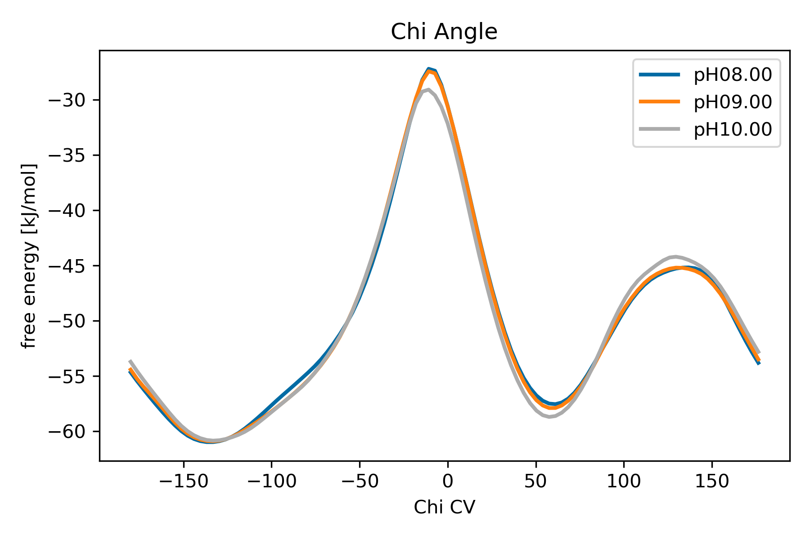

### Q2. Calculate the By observing the plot and examining the populations' values, what can we learn from the pH dependence of this system?

Wt-metadynamics simulations depend on providing enough transitions across the defined range of the CV space to obtain sufficient sampling and a good description of the desired observables. As such, we need to examine if the number of transitions across the full CV range and if there is enough sampling in the transition regions which are typically of high energy. 

```
for pH in pH_values:
    # Load the data from the COLVAR file
    Chi     = np.loadtxt("COLVAR_REWEIGHT_"+str(pH))
    # Plot the time series 
    plt.plot(Chi[:,0]*2/1000,Chi[:,1],label="pH"+str(pH),marker="o",markevery=25,linewidth=0,alpha=0.6)
    plt.xlabel("Time / ns")
    plt.ylabel("$\chi$ Angle")
    plt.legend(ncol=1)
plt.show()

```


### Q3. Are there enough transitions across the full range to state that we are sampling this specific CV space?

Another important property to evaluate is the convergence of the free energy difference. In a simple system such as this, convergence can be assessed by measuring the free energy difference along the simulation time. Then, we will be able to use the converged portion of the trajectory to calculate other observables and estimate standard errors.

To obtain the convergence, we need to compute the free energy along each CV value using the sum_hills module every N steps of the simulation.

```
for pH in ["08.00", "09.00", "10.00"]:
    !plumed sum_hills --hills data/HILLS_pH${pH} --stride 1000 --idw "chi" --kt 2.5 --outfile ff.chi_pH${pH}_

```

The sum_hills module is used to sum the Gaussians stored in the HILLS file by using the --hills keyword. Then it is possible to select one specific CV, using the --idw keyword, to obtain their specific bias.

Then, by iterating through each pH value, we can extract the data of each file and compute the free energy difference of the minima defined by the syn/anti criterion used previously.

```
# Calculate free energy difference between syn and anti minima.

# Since we defined stride=1000 in sum_hills, the tau is equivalent to 10 (1ns).
tau=1 
# Then we cycle through pH and each obtained free energy profile.
for pH in pH_values:    
    DeltaF=[]

    for n in range(0,101):  
        # Load the data for each file. 
        filename="ff.chi_pH"+str(pH)+"_"+str(n)+".dat"
        if os.path.isfile(filename):
            # Import fes file into pandas dataframe
            data=plumed.read_as_pandas(filename)
            # Find minimum value of fes
            minf =np.min(data["projection"])
            F0=0.0; F1=0.0
            
            # Then we convert the free energy at each value of the CV 
            for j in range(0, len(data["chi"])):
                chi = data["chi"][j]
                # Calculate probability
                p = np.exp((-data["projection"][j]+minf)/KbT)
                # And we integrate in one of the two minima
                if(0<=chi<=2.0):   F0 += p
                else: F1 += p
            # Calculate free energy difference and add to list
            DeltaF.append(-KbT*np.log(F0/F1))    
            time = np.arange(0,len(DeltaF)*tau,tau)
    # Then we plot the data
    plt.plot(time,DeltaF,label="F1") 
    plt.legend()
    plt.title("pH"+str(pH))
    plt.xlabel("Simulation time (ns)")
    plt.ylabel("DeltaF [kJ/mol]")
    plt.show()

```
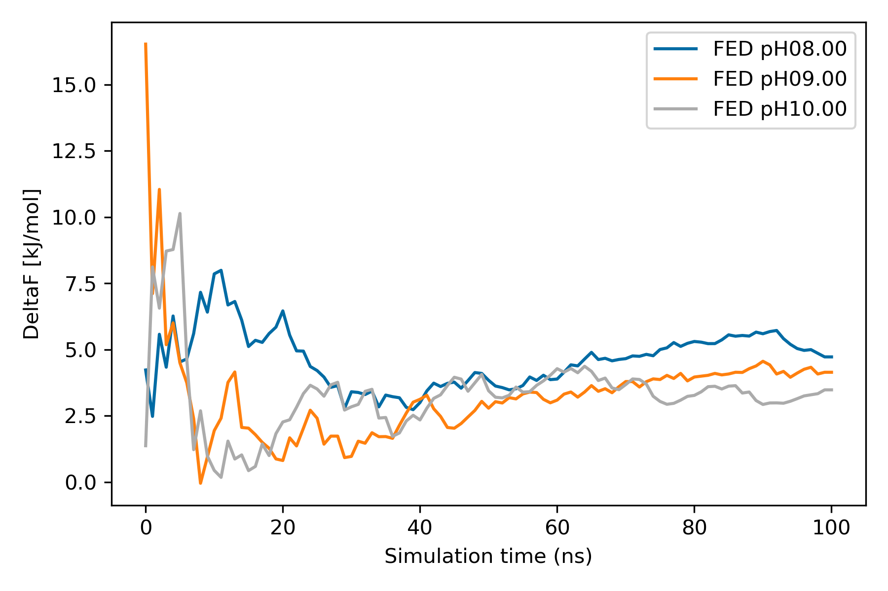

### Q4. Did the free energy difference converge quickly and how much should we discard of our trajectory?

After assessing the convergence of our simulation and defining how much should we discard, we can perform some statistics using block analysis and a bootstrap approach on the converged part of our trajectory. 

First, we are going to reproduce the plot of the free energy as a function of the $\chi$ angle with the standard errors.

```
# First, we define a function to partition the trajectory into blocks
def partition_array(arr, chunk_size):
    return [arr[i:i + chunk_size] for i in range(0, len(arr)-1, chunk_size)]
```

```
# Once again, we iterate through each pH simulation
for pH in pH_values:
    # Load the dataframe
    col = pd.read_csv('COLVAR_REWEIGHT_'+str(pH), sep=" ", header=None, skiprows=range(0,3),usecols=[1,2,3,4],names=["time", "chi", "puck.Zx", "metad.bias"])
    # Discard non-equilibrated segments and define data sets
    chi    = np.array(col['chi'].loc[col['time']>10000])
    bias   = np.array(col['metad.bias'].loc[col['time']>10000])
    maxim  = np.max(bias) #
    weight = np.array(np.exp((bias)/KbT))

    # Define the number of blocks for the converged segment
    bnumber = 5
    # Define the block size
    bsize   = int(len(chi)/bnumber)
    # Use the function to partition each data set.
    bl_chi     = partition_array(chi,bsize)
    bl_weight  = partition_array(weight,bsize)
     
    # Define the parameters for bootstrap
    samples_chi = []
    nsamples    = 1000
    nbins       = 100
    
    # Iterate through the number of samples
    for j in range(nsamples):
        #Generate a list of n blocks to generate subsamples
        n = len(bl_chi)   
        blocks = np.random.choice(n,n,replace=True)
        iter_chi     = []
        iter_weight  = []
        # Generate the nem sub sample with the randomized blocks
        for i in blocks:
            iter_chi.append(bl_chi[i])
            iter_weight.append(bl_weight[i])
        # Generate a reweighted histogram with the new data and weights
        hist_chi, bin_edges   = np.histogram(iter_chi,bins=nbins,weights=iter_weight,density=False)
        # Convert the reweighted histogram to a free energy surface
        fes_chi   = np.array(-KbT*np.log(hist_chi))   
        # Append the output to the list
        samples_chi.append(fes_chi)
    # After obtaining the outputs for all the new samples, estimate the std_deviation
    std_chi    = np.std(samples_chi,axis=0)
    
    # Estimate the mean
    mean_chi   = np.mean(samples_chi,axis=0)
    
    # Then plot the histogram with errors defined as the std_dev
    bin_edges = np.histogram(chi,bins=nbins)[1]
    bin_centers = (bin_edges[:-1] + bin_edges[1:]) / 2
    plt.errorbar(bin_centers,mean_chi,yerr=std_chi,label="pH"+str(pH))
    x_tick = np.arange(-1,1.1,0.5)

    x_label = [r"$-\pi$",r"$-\frac{\pi}{2}$", r"$0$", r"$+\frac{\pi}{2}$",r"$\pi$"]
    plt.minorticks_on()
    plt.xticks(x_tick*np.pi,x_label, fontsize=16)
    plt.yticks(np.arange(-100,-40,10),fontsize=16)
    plt.xlim(-np.pi,np.pi)
    plt.ylim(-90,-40)
    plt.ylabel("F($\chi$) / kJ.mol$^{-1}$",fontsize=16)
    plt.xlabel("$\chi$ Angle$ / rad$ ",fontsize=16)
    plt.legend(fontsize=12,loc="upper left")
plt.tight_layout()
plt.show()

```
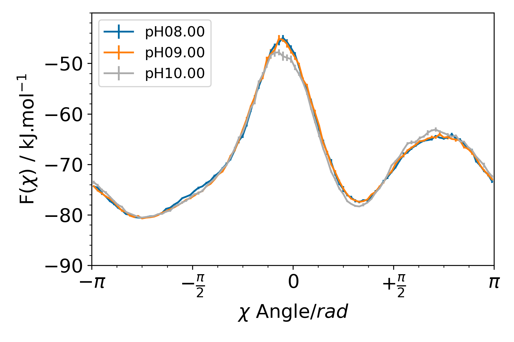

### Q5. How does the new free energy plot compare to the one obtained through the PLUMED module? How big are the error estimates?

### Q6. Attempt to reproduce the previous analyses for the Zx component of the sugar puckering. How does it compare to the $\chi$ angle? 

So far, we have examined how an individual CV depends on the simulation pH and how the population balance of syn/anti and C2'/C3' endo change across the different simulations. Now, we want to compare the 2D free energy surface along all pH values and observe how the energy minima relate to each other.

## Plotting 2D Free Energy Surface in the function of the metadynamics CVs 

First, we need to once again use the sum_hills module to read the HILLS file of each simulation and generate a file with the free energies at each grid point. The grid is defined by both CVs and, at each point, an energy value is assigned after the module sums all the Gaussians deposited during the simulation that are stored in the HILLS file. 

```
%%bash
# For each pH value, we generate a fes.dat file
for pH in 08.00 09.00 10.00
do
    # We define a grid of 100x100 and we read each pH simulation HILLS file
    plumed sum_hills --bin 100,100 --hills data/HILLS_pH${pH}
    mv fes.dat fes_pH${pH}.dat
done

```
After generating each fes_pH.dat file, we can plot the data and it should look like the following plot:

```
for pH in pH_values:
    # Load the data of each fes file.
    X,Y,Z= np.loadtxt('fes_pH'+str(pH)+'.dat',unpack=True)[:][0:3]
    Z-=np.min(Z)
    print(X.shape,Y.shape,Z.shape)
    temp_counter=0
    total_line_counter=0
    block_count_finished=False
    
    with open('fes_pH'+str(pH)+'.dat') as f:
        for count,line in enumerate(f):
            if line != "\n" and '#' not in line:
                temp_counter+=1
            if line == "\n" and block_count_finished==False:
                block_line_counter=temp_counter
                block_count_finished=True
            if line != "\n" and '#' not in line:
                total_line_counter+=1
    print('lines total: ', total_line_counter)
    print('X shape: ',block_line_counter)
    print('Y shape: ', int(total_line_counter/block_line_counter))

    shapeX=block_line_counter
    shapeY=int(total_line_counter/block_line_counter)

    X= np.reshape(X, (shapeY,shapeX))
    Y= np.reshape(Y, (shapeY,shapeX))
    Z= np.reshape(Z, (shapeY,shapeX))


    plt.figure(figsize=(10,8))
    levels=np.arange(0,30,3)
    plt.contourf(X, Y, Z,levels,cmap='jet')
    cbar = plt.colorbar(ticks=levels)
    cbar.set_label(r'$\frac{kJ}{mol}$', rotation=0, labelpad=20,weight='bold',fontsize=20)
    cs=plt.contour(X, Y, Z, levels, colors='black',linewidths=0.5)
    cbar.ax.tick_params(labelsize=15) 
    plt.ylim(-1, 1.0)
    plt.xlim(-np.pi,np.pi)
    plt.title('free energy surface',fontsize=15)


    x_pi   = X*180/np.pi
    x_tick = np.arange(-0.5,0.6,0.5)

    x_label = [r"$-\frac{\pi}{2}$", r"$0$", r"$+\frac{\pi}{2}$"]
    plt.title("pH "+str(pH))
    plt.xticks(x_tick*np.pi,x_label, fontsize=15)
    plt.yticks(fontsize=15)
    plt.xlabel(r'$\chi$',fontsize=15)
    plt.ylabel(r'$puck.Zx$',fontsize=15)
    plt.hlines(0,-np.pi, np.max(X),linewidth=0.5,linestyle='dashed')
    plt.vlines(0,-1, 1,linewidth=0.5,linestyle='dashed')
    plt.tight_layout()
    plt.show() 

```

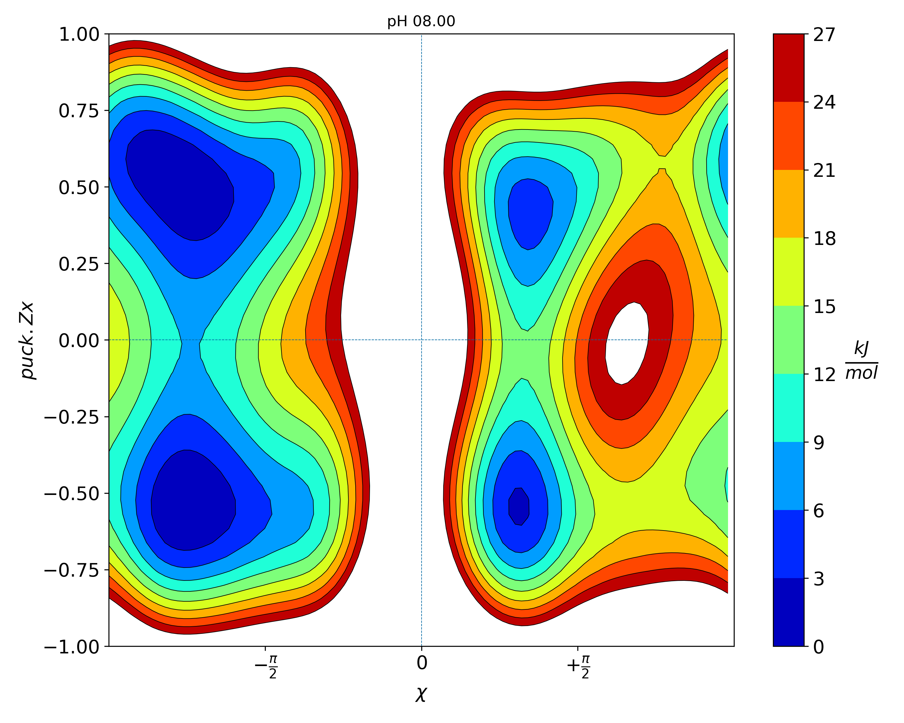
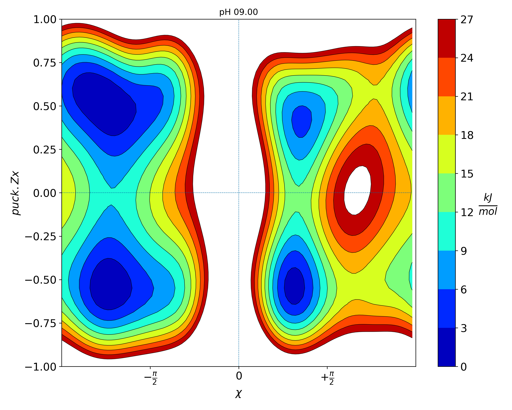


### Q7. Do we identify differences in the energy minima and barriers across the different pH values? What can we say about the system?

# Protonation Analysis

Conformational analyses are fundamental in identifying energy minima, estimating populations of the chosen CVs and other observables, thus assessing how the system behaves at different pH values. Nevertheless, there is an another dimension to CpH-Metadynamics simulations which concerns the protonation analysis.

When we consider how the system behaves at different pH conditions, we are evaluating how the protonation balance (i.e. the average protonation) of the titrable sites impact the conformational part. Therefore, it is important to consider how the protonation states change throughout the simulation or what is the average protonation of different energy minima. One important and distinctive property is the pKa. 

The pKa is the pH at which 50%  of the population of a titrable site is protonated and the other 50% is deprotonated. Hence the pKa measures the proton binding affinity of a titrable site at a given pH value. Typically, if the solution pH < pKa, then the population of protonated states is more likely to be larger than the population of deprotonated states. If the pH > pKa, then the population of deprotonated states is likely to be larger than the population of protonated states. At pH=pKa, the protonation and deprotonation probability is equal, thus there is a thermodynamic equilibrium. 

The pKa is typically associated with the Henderson-Hasselbalch equation, which describes the relationship between the pKa, pH, and the balance between the protonated and deprotonated populations:

$$ pH = pKa + log(\frac{[A-]}{[AH]}) $$

Usually, changes in pKa are measured as pH units, however, they can be translated into kJ/mol. pH variations can be measured as a $\Delta\Delta$ G of the protonation-free energies at two distinct pH values. Since the protonation-free energy can be described as:

$$ \Delta\text{G} = -\ln(10) \cdot RT \cdot (pKa - pH) $$

where R is the gas constant, T is the temperature in Kelvin. Then the energy associated with a pH unit change is:

$$ \Delta\Delta\text{G} = -\ln(10) \cdot RT \cdot (pH_f - pH_i) $$

which for a $ \Delta pH=1 $ is roughly:

$$ \Delta\Delta\text{G} \approx -5.7 \text{kJ/mol at 298K} $$

These energetic contributions can impact significantly thermodynamic equilibria, change conformational probabilities and balance between populations. Therefore, using these relationships, we will see how we are able to plot titration curves, estimate pKa values and measure energy differences using CpH-metaD simulations. 

In the uridine system, the nucleobase has a pKa of 9.22 at the N3 atom. This means that at pH < pKa, most of the population should be protonated, hence in a neutral state. While for  pH >  pKa, most of the population should be deprotonated, hence in a negatively charged state. How do these charge variations impact our system? Can we measure changes in protonation at different pH values and along the simulation time? Is each energy minima distinguishable by their average protonation? If so, then why and how does electrostatics play a role?

These are all questions to be addressed in the following section.

## Extracting the protonation data

We need to extract the protonation data stored in the .occ files. These files contain information of the proton occupation state of each titrable site along segments of the simulation. These files are generated after each cycle of CpHMD and the total number of lines matches the $ Time_{seg}/\tau_{p} $, which is the time of segment (1000 ps) over the frequency of protonation (20 ps). 

Each column corresponds to a distinct titrable site and each row to different timestamps (typically every 20 ps). Then the occupation state is defined by the parametrized states found in the St-XOL3_DelPHi folder. For example, the uridine has two states: URN0 and URN1. URN0 refers to the neutral (0) state, hence the protonated state, while URN1 refers to the charged (-1) state, hence the deprotonated state. In the .occ file, if the occupation state is 0, then it means it is protonated. However, for the adenine, the AR0 also refers to the neutral state, however in this case it is the deprotonated state, and AR1 is the protonated (+1) state. Hence in this specific case, the protonation and occupation states match and we don't need to correct.
Typically, binary protonable sites  do not need to be corrected, as for the adenine and cytidine, while deprotonable sites (uridine and guanine) require this conversion to obtain the protonation states. Sites with multiple tautomers always need a correction since in those cases, each occupation state refers to a different position of the proton.

First, we are going to generate a data frame to store all the data found in the .occ files for the different pH values.

```
# First we create a pandas dataframe for time and protonation states
protdf    = pd.DataFrame(columns=['Time','Protonation'])
# We define the number of segments of our simulation
segs      = range(0,11)
prots     = {}
pH_values = ['08.00','09.00','10.00']
# We define the frequency of protonation as in the CpHMD settings (20ps)
taup      = 20

# Create a dictionary for the data
prots = {"pH":[],"Time":[],"Protonation":[]}

# We iterate through each pH
for pH in pH_values:
    # Then for each segment
    for seg in segs:
        # We obtain the time range of each segment
        time = seg*10000-10000
        # Get the occ files from the data folder
        path = "data/occ_pH"+str(pH)+str("/")
        itemList =  os.listdir(path)
        # Iterate through each .occ file to obtain the protonation states
        for file in itemList:
            if ".occ" in file and seg == float(file[-7:-4]):
                with open(path+file) as f:
                    for line in f:
                        # Save the time, pH and protonation state
                        prots["Time"].append(int(time))
                        prots["pH"].append(pH)
                        prots["Protonation"].append(float(line.strip()))
                        time += taup
    
protdf = pd.DataFrame.from_dict(prots,orient='columns')
protdf.reset_index(inplace=True)
print(protdf)

```

After extracting all the data and assigning the proper timestamps, we can define the frequency of protonation. While we only calculate the protonation information every 20~ps, in reality, we can propagate the stored protonation states to the intermediate frames within each protonation calculation. If the simulation timestep is 2 ps and the $\tau_{p}$ is 20 ps, then the protonation states of these intermediate frames correspond to the state assigned in the previous cycle. 

```
dfs  = []
# Define the frequency of protonation
taup = 20
# Define the timestep of the simulation
taus = 2

for pH in pH_values:
    # Get last time for each pH series based on occ
    pH_time = protdf['Time'].loc[protdf["pH"]==pH].max()
    # Expand the fixed protonation to frames every 2 ps (simulation)
    tmp = pd.DataFrame(protdf.loc[protdf["pH"]==pH])
    new_pH_time = pd.Series(range(0, pH_time + taup, taus), name='Time').to_frame()
    # Merge and propagate the protonation based on both dataframes
    final_protdf = pd.merge_asof(new_pH_time, tmp, on=["Time"])#,direction='forward')
    dfs.append(final_protdf)

# Concatenated dataframe of all pH data   
final_protdf = pd.concat(dfs)
# Examine the dataframe
print(final_protdf)

```

Since we are performing CpH-Metadynamics simulations, we require the weight data from the accumulated bias in the simulation. Protonation and conformation are intrinsically coupled, then biased conformations dictate that their protonation states should also be unbiased. To do that we need to obtain the weights and correctly assign them to the corresponding frames. 

```
# Define a list for the weighted dataframes
wprot = []

# Iterate through each pH value
for pH in pH_values:
    # Load the data of COLVAR
    col = pd.read_csv('COLVAR_REWEIGHT_'+str(pH), sep=" ", header=None, skiprows=range(0,3),usecols=[1,2,3,4],names=["Time",'chi','puck.Zx', "metad.bias"])
    # Define the maximum bias for a better numerical approximation
    maxim=np.max(col['metad.bias']) 
    # Calculate the weights
    weights=np.exp((col['metad.bias']-maxim)/KbT)
    # Normalize the weights
    weights=weights/np.sum(weights)
    # Define a new column in the dataframe
    col['Weight']=weights
    # Correct the time column
    time = np.array(col['Time']*2)
    col['Time'] = time
    # Merge the two dataframes (protonation and COLVAR)
    pdf1 = pd.merge(final_protdf.loc[final_protdf['pH']==pH], col[['Time','chi','puck.Zx','Weight']],left_on="Time",right_on="Time",how="left")
    # Append each pH dataframe to the list    
    wprot.append(pdf1)

# Create dataframe with Weights
rewprot = pd.DataFrame(columns=['pH','Time','Protonation', 'Weight'])
# Concatenate all pH dataframes into a single on
rewprot = pd.concat(wprot)
rewprot.drop('index',axis=1)
# If there are any rows with nan values due to mismatch when sims are not complete. This should be commented if the simulation ended
# To check for possible mismatch errors
rewprot=rewprot.dropna()

```

### Q8. Examine the final dataframe. Do the timestamps of the protonation states match the conformational data? Are all the pH values present?

After obtaining the final dataframe with all the pH values, protonation and conformation data and the weights, we can calculate average protonations, derive a titration curve, and estimate the pKa. To plot a titration curve, we need to redefine the Henderson-Hasselbalch (HH) relationship between pH, pKa and protonation. We can rewrite the HH function as follows:

$$ \langle P \rangle = \frac{1}{1 + 10^{pH - pKa}} $$

where <P> is the average protonation at a certain pH value, pH is the assigned value of the simulation and the pKa is the fitted parameter. However, we are dealing with biased simulations, then we need to calculate the weighted average protonations:

$$ \langle P^* \rangle = \frac{\sum_i P_i \times e^{\frac{B_i}{k_B T}}}{\sum_i e^{\frac{B_i}{k

where <P*> is the weighted average protonation, B_i is the accumulated bias accumulated at the end of the metadynamics simulations calculated on the coordinates corresponding to the i-th frame. Knowing this relationship and how to get the weighted protonation averages, we can fit the simulation data to the HH function and obtain a pKa estimate.

```
## Calculate average protonation for each pH value
data = []
x = []
y = []
w = []

for pH in pH_values:
    # We discard the equilibration time obtained previously
    equil  = 00000
    tlimit = 100000
    # Load the dataframe with all the data
    vals   = pd.DataFrame(rewprot[['pH','Protonation','Weight']].loc[(rewprot["pH"]==pH) & (rewprot["Time"] >= equil)& (rewprot["Time"] < tlimit)])
    weights = vals["Weight"]
    weights = weights/np.sum(weights)
    # Convert the occs into prot states
    occs   = vals["Protonation"] 
    # Remember that for uridine and guanine, the 0 state is the neutral/protonated state.
    prots  = 1-np.array(occs)
    
    # Obtain the weighted average using the normalized weights
    avx = np.sum(prots*weights)
    data.append((pH,avx))
    print(pH,avx,np.sum(prots)/len(prots))

```

### Q9. What can we determine from the average protonations? Do they follow an expected trend?

After obtaining the reweighted data, now we can use the HH relationship to plot a titration curve and determine the uridine pKa. 

```
# Define a tolerance for the upper and lower limtis of average protonation
# Average protonations too close to the upper (1) and lower (0) bounds should not be used
tol = 0.01  
for val in data:
    if val[1] > tol and val[1] < 1-tol:
        x.append(float(val[0]))
        y.append(val[1])

# Define arrays for the pH, protonation and weight data               
x = np.array(x)
y = np.array(y)

# Obtain an initial guess of the pH closer to the pKa     
minndx = 0
for i in range(len(y)):
    if abs(0.5-y[1]) < abs(0.5-y[minndx]):
        minndx = i
# This guess will be used as a reference for the HH function            
pKainit = x[minndx]
    
def Hill(x, pKa, n):
    return 1.0 / (1.0 + 10.0**(n*(x - pKa)))
def HH(x, pKa):
    return 1.0 / (1.0 + 10.0**(x - pKa))
    
params = curve_fit(HH,x,y,p0=[pKainit])
    
x_new = np.linspace(-5,14,1000)
y_new = HH(x_new,params[0][0])
print('## {:5.2f}'.format(params[0][0]))
pKa_fit = '{:5.2f}'.format(params[0][0])


plt.tight_layout()
plt.xlabel("pH")
plt.ylabel("Protonation")
plt.xlim(6.0,11.2)
plt.plot(float(pKa_fit),0.5,"ro")
plt.plot(x,y,"ko")
plt.annotate(pKa_fit,(float(pKa_fit),0.5))
plt.plot(x_new,y_new)

```


Although the final pKa result is slightly underestimated by our simulations, as the experimental pKa is 9.22, the simulations were done on our approach that aims to reflect pKas in an RNA construct and not the single nucleoside. As such, this result is expected. However, one should take notice of the analysis steps required to achieve the result.

Additionally, using the previous rationale, we can apply a bootstrap approach to determine some statistics on the protonation data. For instance, we evaluate the confidence in our estimates by estimating the standard error and plotting histograms of the subsamples. First, we run the function that partitions the data into blocks and generates the new samples.

```
def bt_avgprots(data,weights,nblocks,nsamples):
    data_blocks    = np.split(data,nblocks)
    weights_blocks = np.split(weights,nblocks)
    bt_samples     = []
    #
    for i in range(nsamples):
        new_data   = []
        new_weight = []
        blocks = np.random.choice(nblocks, nblocks, replace=True)
        for j in blocks:
            new_data.append(data_blocks[j])
            new_weight.append(weights_blocks[j])
        prot_tmp = np.average(np.array(new_data),weights=np.array(new_weight))
        bt_samples.append(prot_tmp)
    
    return bt_samples

```
Then we can provide the input data and draw the output.

```
sims_err = []
# Iterate through each pH value.
for pH in pH_values:
    # Convert the .occ data to the protonation states.
    data_prot   = 1-np.array(rewprot["Protonation"].loc[rewprot["pH"]==pH])
    # Get the weights
    data_weight = np.array(rewprot["Weight"].loc[rewprot["pH"]==pH])
    # Run the bootstrap function with the desired parameters
    # Here we ran 1000 samples with the data partitioned into 20 blocks
    out_bt = bt_avgprots(data_prot,data_weight,20,1000)
    sims_err.append(np.std(out_bt))
    print(np.average(out_bt),np.std(out_bt))
    hist, bin_edges = np.histogram(out_bt)
    plt.hist(out_bt,bins='auto',label=pH)
    plt.legend()
plt.show()

```

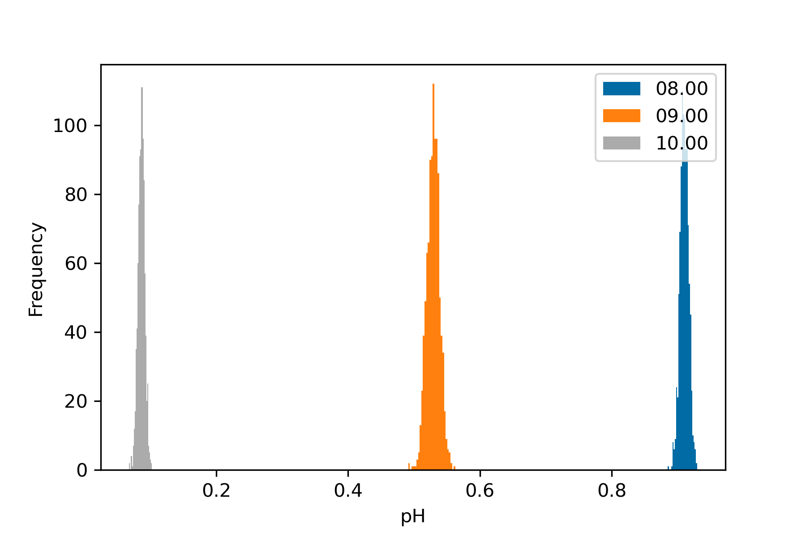

### Q9. Does the protonation of a particular pH simulation exhibit more variability? If yes, then is there any biological/chemical significance?

Similarly for the protonation, we can also calculate the error of our pKa estimation by performing a bootstrap procedure. To do that, first we need to define the following function:

```
# Define the bootstrap function. Bootstrap with HILLS reweight to the blocks
# In this version, we provide the explicit reweight blocks to the curve fit with a weight = 1/n_block
# n_block is the number of repetitions of each block in the resampling. This way we fit n values, where n is the number of blocks.
# In the previous version, we estimate the weighted average, at a given pH, only then we do the fit. So it has 3 fit values. 

def HH(x, pKa):
    return 1.0 / (1.0 + 10.0**(x - pKa))
    
def bootstrap_fit(data1,data2,data3, fit_func,nsamples,nblocks):
    fit_parameters = []
    for j in range(nsamples):
        
        # Reset data subset lists
        prot_blocks   = []
        weight_blocks = []
        
        #
        data2_blocks = np.split(data2,len(data1))
        data3_blocks = np.split(data3,len(data1))
        p_blocks = []
        w_blocks = []
        for j in range(0,len(data2_blocks)):
            tmp_prot   = np.array(np.split(data2_blocks[j],nblocks))
            tmp_weight = np.array(np.split(data3_blocks[j],nblocks))
            p_blocks.append(tmp_prot)
            w_blocks.append(tmp_weight)

        weighted_prots = []

        for j in range(0,len(data2_blocks)):
            # Create random data subset
            blocks = np.random.choice(nblocks, nblocks, replace=True)

            for i in blocks:
                prot_blocks   = p_blocks[j][i] 
                weight_blocks = w_blocks[j][i]
                w_prot = np.sum(prot_blocks*weight_blocks)/np.sum(weight_blocks)
            weighted_prots.append(w_prot)

        # Check pKainit over all pH values until it finds the closest one whose prot block average is close to 0.5 (pKa)
        nhill   = 1
        last    = 1
        pKainit = 9.5
        #
        for iter in range(0,len(data1)):
            avx = np.average(weighted_prots[iter])
            if abs(avx - 0.5) < abs(last - 0.5):
                last    = avx
                pKainit =float( data1[iter])

        ## Fit to selected function
        if fit_func == HH:
            p0 = pKainit
        elif fit_func == Hill:
            p0 = [pKainit,nhill]
            # Get pKa and Hill coeficient (n) parameters
        popt, _ = curve_fit(fit_func,data1,weighted_prots,p0)
        pKa = popt[0]
        fit_parameters.append(pKa)
        
    return np.array(fit_parameters)

```
After defining the bootstrap function to estimate the pKa for the chosen number of sub-samples, let's use the bootstrap_fit function. It takes as input:
- an array of the simulated pH values;
- an array of the protonation states ;
- an array of the weights of each frame ;

```
pH_values = np.array( [08.00,09.00,10.00])
prots   = 1-np.array(rewprot["Protonation"])
weights = np.array(rewprot["Weight"])
out = bootstrap_fit(pH_values, prots, weights,HH,1000,50)
bt_pKa_fit = np.sum(out) / len(out)
bt_sem = np.std(out) 
print(bt_pKa_fit,bt_sem)
plt.xlabel('pH')
plt.ylabel('Frequency')
plt.hist(out)
```
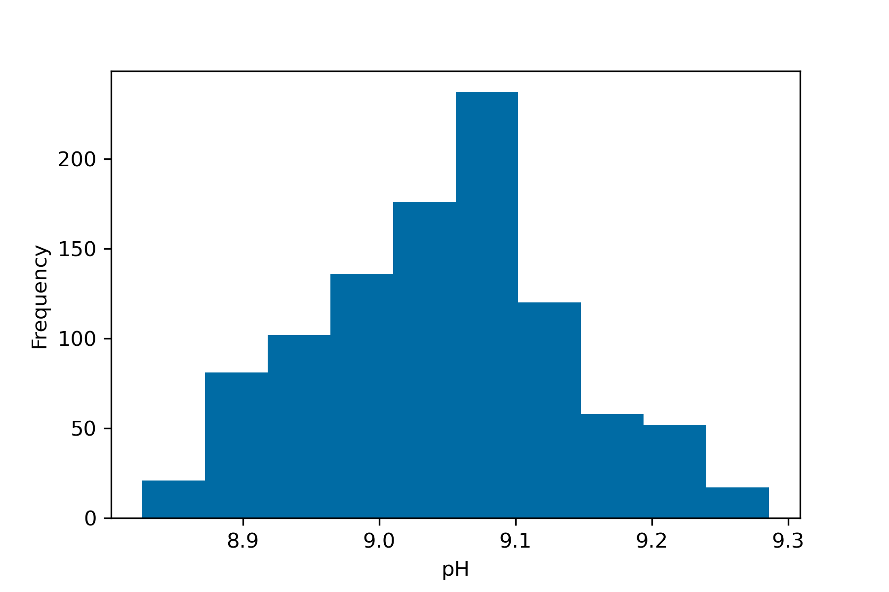

### Q10. Is the pKa estimate and the error close to the experimental data? 

The previous analyses are the straightforward way to perform pKa and average protonation estimates by simply reweighting the data. However, one of the major advantages of performing CpH-Metadynamics is the ability to use the binless Weighted Histogram Analysis Method (WHAM) to combine data from all simulations at different pH values to obtain more accurate estimates of the system of interest.

# A binless WHAM Reweight approach to combine CpH-MetaD simulations

In this approach, we use a binless WHAM module (https://bussilab.github.io/doc-py-bussilab/bussilab/wham.html) to obtain weights derived from the accumulated biases and the chemical potential (pH) of each simulation using their protonation information. 

The procedure consists on the following rationale: 
- concatenate all the CpH-MetaD equilibrated trajectories ;
- recompute the biases ($B_k$) of the concatenated trajectory for each simulated $k$ pH using their respective HILLS. I.e. if we have $k$ pH simulations, we run the plumed driver $k$ times for each HILLS_k ;
- correct each bias ($B_k$) with the corresponding protonation-dependent contribution for each frame $i$ ;

- thus we obtain a final bias matrix:


$$ M_{k,i}^{\text{Bias}} = \frac{B_{k,i}}{k_{B} T} + pH_k \times P_{i} \times \log(10


This bias matrix contains each reweighted bias potential ($k$) dependent of each frame's protonation state ($P_i$) and the simulation pH ($pH_k$) for the concatenated trajectory. Then we use the bias matrix to compute the weights using the binless WHAM implementation. Afterward, we can compute weights for arbitrary pH values to reweight any observable property of the systems.

In this section, we will examine how to obtain the pH-dependent bias matrix and how to derive observable properties at any desired pH values.

First, we need to import the necessary packages and define a function to compute the weights.

```
# We need to import the bussilab and plumed packages
import bussilab
import plumed
# This is a function to process the result and obtain normalized weights of each frame
# at arbitrary pH

def compute_weights(N,pH,w):
    logW=w.logW-(np.log(10)*pH*N)
    logW-=np.max(logW)
    weights=np.exp(logW)
    weights/=np.sum(weights)
    return weights

```

## Extracting the trajectory:
The next step is to obtain the concatenated trajectories. In the data folder, there is a script ($\textbf{get\_concat\_traj.sh}$) to be run locally. Examine the script and run it to obtain the concatenated trajectories.

## Recomputing the bias:
After obtaining the concatenated trajectory, please examine the ($\textbf{run\_colvar\_wham.sh}$) to obtain the recomputed biases for the concatenated trajectory using each pH HILLS file. 

### Q11. Examine the TOTVAR_REWEIGHT_pH output of each run. Compare them between each other. How do they differ from one another?

### Q12. Compare each output to the COLVAR files of the individual trajectories for the same pH values. Are they similar in any way?

Note: This comparison is a good sanity check to confirm that the obtained biases are correct.

Next, we need to obtain the bias matrix necessary for the binless WHAM.

```
# Create necessary lists
N       = []
colpH   = []
biaspH  = []

# Define the pH arrays
pH_values = ["08.00","09.00","10.00"] # 
pH_array  = np.array([8.0,9.0,10.0])

# Iterate through each pH
for pH in pH_values:
    # Load each output of the concatenated trajectories as a distinct pH dataframe 
    df    = plumed.read_as_pandas("TOTVAR_REWEIGHT_" + str(pH))
    # Extract the bias and store it
    colpH = np.array(df["metad.bias"])
    biaspH.append(colpH)

# Be careful with the sorting of the data to avoid mismatches
# Define the protonation array using the stored data in the rewprot dataframe
N = 1-np.array(rewprot["Protonation"])

# Transpose the array to match the matrix
biaspH = np.array(biaspH).T 

# Correct the bias matrix with the pH-dependent protonation contribution
# This is done by doing the dot product of each bias with the correspoding protonation data
# and pH. 

# The energy contribution is given by: log(10)*pH_k*prot_i 
# and that is applied to each corresponding entry (i,k) of the matrix 
bias = np.outer(N,(np.log(10)*pH_array))+biaspH/KbT
# Get the array length to apply a weight based on the trajectory length
# This will adjust the contribution in case of differently lengthed trajectories
lpH1 = len(np.array(protdf["Protonation"].loc[(protdf["pH"]=="08.00")])) 
lpH2 = len(np.array(protdf["Protonation"].loc[(protdf["pH"]=="09.00")])) 
lpH3 = len(np.array(protdf["Protonation"].loc[(protdf["pH"]=="10.00")])) 
min = np.amin([lpH1,lpH2,lpH3])

# Get the relative trj length for each pH value
rtrj1 = lpH1/min
rtrj2 = lpH2/min
rtrj3 = lpH3/min

# Get the final weights based on the bias matrix
w = bussilab.wham.wham(bias,normalize=False, method='minimize',traj_weight = [rtrj1,rtrj2,rtrj3])

```

After obtaining the weights using the binless WHAM, we can apply them to different properties by using the compute_weights function defined earlier. For example, we can compare average protonations across any pH range and compare them to the individual trajectory estimates.

```
for pH in np.arange(8.0,10.2,0.2):
    print(pH,np.average(N,weights=compute_weights(N,pH,w)))

```

Afterward, by using the full sampling of our simulations and generating weights for any given pH, we can plot a more complete titration curve compared to the one obtained previously.

```
# Define the desired pH range for the calculation
pH_array = np.arange(8.0,10.2,0.05)

# Define necessary lists
rprots   = []

# Iterate through each pH value of the defined range
for iter in pH_array:
            # Get the average protonation using the computed weights for the desired pH
            avx = np.average(N,weights=compute_weights(N,iter,w))
            rprots.append(avx)

# Compute the absolute difference relative to the midtration point
rprots    = np.array(rprots)
min_diffs = np.abs(rprots - 0.5)
 
 # Get the indices of the two smallest differences
indices = np.argsort(min_diffs)[:2]
 
 # Return the corresponding values
closest = pH_array[indices]
pKa_fit = np.mean(closest) 
pKa_fit = '{:5.2f}'.format(pKa_fit)
print(pKa_fit)
# Import the average protonations from the individual trajectories stored in data
x = []
y = []

for val in data:
    x.append(float(val[0]))
    y.append(val[1])
#
plt.figure(figsize=(10,8))
#
plt.plot(pH_array,rprots,'#9bc1d1',linewidth=8,label="WHAM fit")
plt.plot(x,y,"ko",markersize=12,label="$\overline{Prot}_{Sim}$ ")
plt.plot(float(pKa_fit),0.5,markersize=12,marker="o",color="red",label="p$\it{K}_a$ WHAM")
plt.xlabel("pH",fontsize=34)
plt.ylabel("Protonation",fontsize=34)
plt.xticks(np.arange(7.0,11.1,step=0.5),fontsize=28)
plt.yticks(np.arange(0,1.2,step=0.2),fontsize=28)
plt.xlim(7.9,10.05)

plt.legend(fontsize=16)
plt.tight_layout()
plt.show()

```


### Q13. Compare the titration curve, the individual average protonations and the pKa estimate. How do the two approaches - binless WHAM and standard - compare to each other?

As a follow-up to calculating the titration curve, average protonations for a pH range and the pKa using the binless WHAM procedure, now we will see how we can use this information and the previously used bootstrap procedure to obtain error estimates.

In the first, we will define the bootstrap function as done previously.

```
# Define the function that takes as inputs the bias data, the protonation array
# the desired pH array and the number of bootstrap iterations.

def bt_wham(bias,N,pH_array,nsamples):
    fit_parameters = []
   
    for j in range(nsamples):
        n = len(bias)   
        blocks = np.random.choice(n,n,replace=True)
        bias_array = []
        prot_array = []
        for i in blocks:
            bias_array.append(bias[i])
            prot_array.append(N[i])

        N_new    = np.concatenate(prot_array)
        bias_new = np.concatenate(bias_array)
        # Get the weights
        w_new = bussilab.wham.wham(bias_new,normalize=False)

        rprots = []

        for iter in pH_array:
            avx = np.average(N_new,weights=compute_weights(N_new,iter,w_new))
            rprots.append(avx)

         # Compute the absolute difference from the point
        rprots = np.array(rprots)
        min_diffs = np.abs(rprots - 0.5)
         # Get the indices of the two smallest differences
        indices = np.argsort(min_diffs)[:2]
         # Return the corresponding values
        closest = pH_array[indices]
        pKa_bt = np.mean(closest) 
        fit_parameters.append(pKa_bt)

        
    return np.array(fit_parameters)

```

Here we slightly changed the bootstrap approach to be compatible with the bias matrix. Basically, we are reconstructing the obtained bias matrix for every iteration by generating new subsamples using the partitioned blocks. This way, we have a distinct weights applied to our data, hence different average protonation and pKa estimates.

To do this, then we need to partition our data into blocks before giving as an input to the $bt\_wham$ function.

```
# Bootstrap the matrix instead of the individual data
biaspH   = []
# Define the input pH range and the desired pH range
pH_input =  np.array([8.0,9.0,10.0],dtype=float) 
pH_array = np.arange(8.0,10.2,0.05)

# Load the data from the TOTVAR files
for pH in pH_values:
    df    = plumed.read_as_pandas("TOTVAR_REWEIGHT_" + str(pH))
    colpH = np.array(df["metad.bias"])
    biaspH.append(colpH)

# Correct the .occ state and protonation state
N = 1-np.array(rewprot["Protonation"])
biaspH = np.array(biaspH).T
bias   = np.outer(N,(np.log(10)*pH_input))+biaspH/KbT

# Define the total number of blocks. 
# Rule of thumb: Consider how many blocks each pH trajectory should be partitioned into.
# Then multiply by the number of pH values. 
nblock = 30

# Partition the data into blocks
bias_m = np.vsplit(bias,nblock)
N_arr  = np.split(N,nblock)

# Run the bt_wham function for N iterations.
bts_pka = bt_wham(bias_m,N_arr,pH_array,500)

```

Then we can plot an histogram of our results and estimate the error.

```
boot_pKa = np.sum(bts_pka)/len(bts_pka)
boot_err = np.std(bts_pka)
plt.hist(bts_pka,bins="auto")
print(boot_pKa,boot_err)

```
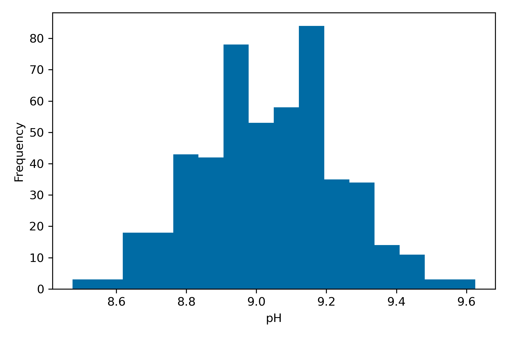

### Q14. What does the histogram look like? Is the error estimate better than the one obtained previously?

Using a similar rationale, we estimate the error associated with each average protonation. We define a bt_prot function to generate sub-samples for the protonation and weights. The bt_prot function will take as input:
- an array with the bias for each frame ;
- an array of the protonation states ;
- an array with the desired pH range ;
- the number of samples (iterations) ;

```

def bt_prot(bias,N,pH_array,nsamples):
    rprots = [] 
    for j in range(nsamples):
        n = len(bias)   
        blocks = np.random.choice(n,n,replace=True)
        N_new    = []
        bias_new = []
        for i in blocks:
            bias_new.append(bias[i])
            N_new.append(N[i])
        N_new    = np.concatenate(N_new)
        bias_new = np.concatenate(bias_new)

        # Get the weights for each pH
        w_prot = bussilab.wham.wham(bias_new,normalize=False)
        sample_prot = []
        for pH in pH_array:
           avx = np.average(N_new,weights=compute_weights(N_new,pH,w_prot))
           sample_prot.append(avx)
        
        rprots.append(np.array(sample_prot))
    return rprots

```
Then we can apply the new bt_prot function to our data.

```
biaspH   = []
pH_input = np.array([8.0,9.0,10.0],dtype=float) 
pH_prots = np.arange(8.0,10.1,0.05)
for pH in pH_values:
    df    = plumed.read_as_pandas("TOTVAR_REWEIGHT_" + str(pH))
    colpH = np.array(df["metad.bias"])
    biaspH.append(colpH)

N = 1-np.array(rewprot["Protonation"])
biaspH = np.array(biaspH).T
bias   = np.outer(N,(np.log(10)*pH_input))+biaspH/KbT
#
nblock = 30 
#
bias_m = np.vsplit(bias,nblock)
N_arr  = np.split(N,nblock)
#
boot_prots = bt_prot(bias_m,N_arr,pH_prots,500)
boot_prots = np.array(boot_prots).T

```

After doing the bootstrap procedure, we can print and plot the averages and associated errors.

```
for n in range(0,len(boot_prots)):
    pH = pH_array[n]
    prot_avx = np.sum(boot_prots[n])/len(boot_prots[n])
    err      = np.std(boot_prots[n])
    plt.xlabel('pH')
    plt.ylabel('Protonation')
    plt.yticks(np.arange(0,1.2,0.2))
    plt.errorbar(pH,prot_avx,yerr=err)
plt.show()

```

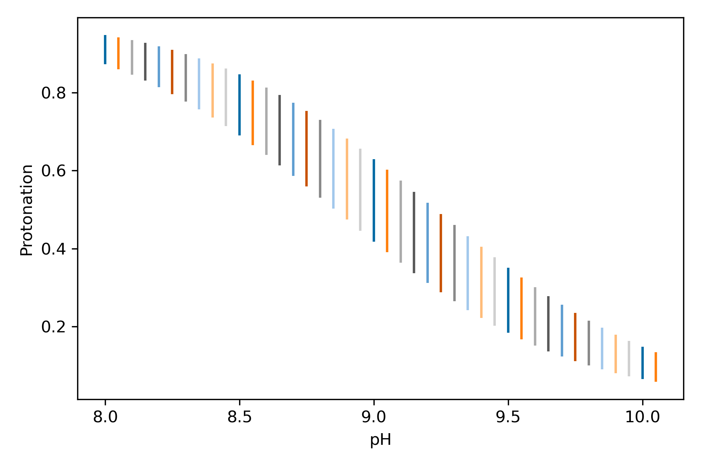

# WHAM Reweight for conformational observables

With the WHAM-derived weights, we can also provide data of conformational observables, such as the chosen CVs, and calculate their reweighted properties at any given pH value. In this section, we will compute the $\chi$ angle at multiple pH values besides the ones that were simulated and interpet their information. This approach will provide a more robust description of the system as it combines data of multiple simulations to reconstruct the CV space. Note that it is important that for the method to work, there needs to be a reasonable overlap between the simulations.

Additionally, we can also compute pKas dependent on conformational properties. For example, what if we are interested in the pKa in function of the $\chi$ angle. First, we need to compute the binless WHAM weights as we did previously for the pKa estimates.

Attempt to modify the code based on previous exercises.

```
N       = []
colpH   = []
biaspH  = []

pH_array  = np.arange(8.0,10.2)
for pH in pH_values:
    df    = plumed.read_as_pandas("TOTVAR_REWEIGHT_" + str(pH))
    colpH = np.array(df["metad.bias"])
    biaspH.append(colpH)

N = 1-np.array(rewprot["Protonation"])
biaspH = np.array(biaspH).T 

bias = np.outer(N,(np.log(10)*pH_array))+biaspH/KbT
# Get the array length to apply a weight based on the trj length
lpH1 = len(np.array(rewprot["Protonation"].loc[(rewprot["pH"]=="08.00")])) 
lpH2 = len(np.array(rewprot["Protonation"].loc[(rewprot["pH"]=="09.00")])) 
lpH3 = len(np.array(rewprot["Protonation"].loc[(rewprot["pH"]=="10.00")])) 
min = np.amin([lpH1,lpH2,lpH3])
# Get the relative trj length for each pH value
rtrj1 = lpH1/min
rtrj2 = lpH2/min
rtrj3 = lpH3/min
print(rtrj1,rtrj2,rtrj3)
# Get the weights for each pH
w = bussilab.wham.wham(bias,normalize=False, method='minimize',traj_weight = [rtrj1,rtrj2,rtrj3])

```

After obtaining the weights, we can load the desired observable data and apply these weights within the same pH range.

```
# Define the pH array and the data arrays
pH_array    = np.arange(8,10.2,0.5)
N           = 1-np.array(rewprot['Protonation'])
chi         = np.array(rewprot['chi'])

# Iterate through each pH of the array
for pH in pH_array:
    # Obtain the weights
    pH_weights = compute_weights(N,pH,w)
    # Obtain the reweighted histogram
    hist, bin_edges = np.histogram(chi,bins=100,density=True,weights=pH_weights)
    hist = hist/np.sum(hist)
    #plt.xlim(-3.15,3.15)
    plt.title("chi by pH")
    plt.xlabel("chi")
    plt.ylabel("PDF")
    plt.plot(bin_edges[:-1],hist,label="pH"+str(pH),linewidth=2)
    plt.legend()
plt.show()

```
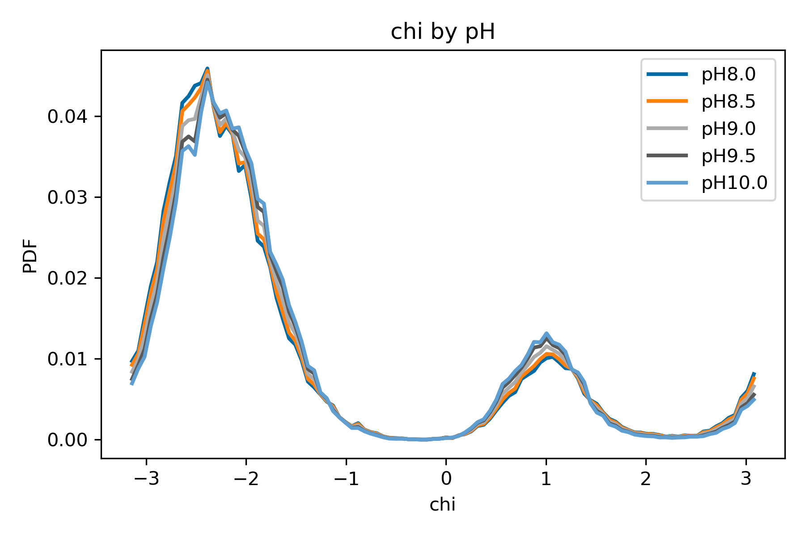

### Q15. How does the syn/anti population balance change along with pH? Does it differ a lot from the initial calculations that we did?

Note: In nucleobases, the lack of the negatively charged phosphate group removes a significant contribution of electrostatic to drive repulsion with the deprotonated state of uridine. As such, conformational properties of the nucleoside should be mainly pH-insensitive. 

On another note, we can also adjust the contribution of the observable property to the estimated weights. For example, if we desire to do a scan of how relevant the $\chi$ angle is to the estimated pKa or how much the sugar puckering affects the $\chi$ angle distribution, we can adjust the weights based on another observable property.

First, we need to change the compute_weights function:

```
# this is a function to process the result and obtain normalized weights of each frame
# at arbitrary pHb
# This has an additional term "prop": an array of 0,1 to exclude or include the weight to the assigned value.
# This allows to select specific ranges of data to recompute our histograms.
# i.e. If we assign a 1 to values within the 0-2 chi angle region, these values will be excluded as the weights converts to 0 
# Or it can diminish their contribution by multiplying by a factor 0.25 i.e.
def compute_weights_prop(N,pH,w,prop):
    logW=w.logW-(np.log(10)*pH*N)
    logW-=np.max(logW)
    weights=np.exp(logW)
    weights*=(1-1*prop)
    weights/=np.sum(weights)
    return weights

```

After redefining the function, we load the data of the desired observable and the property that we want to adjust for. In this case, we want to see how much the $\chi$ angle distribution depends on the C2'/C3' endo conformation of the ribose.

```
pH_array    = np.arange(8,11.2,0.5)
Zx          = np.array(rewprot['puck.Zx'])
N           = 1 - np.array(rewprot['Protonation'])
chi         = np.array(rewprot['chi'])
# We filter out values where the sugar puckering is C2' endo, hence negative values.
puck        = 1.0*(Zx<0) #* 1.0*(chi>0) # 

# Iterate through each pH
for pH in pH_array:
    pH_weights = compute_weights_prop(N,pH,w,puck)
    hist, bin_edges = np.histogram(chi,bins=50,density=True,weights=pH_weights)
    hist = hist/np.sum(hist)
    plt.xlim(-3.15,3.15)
    plt.title("chi by pH")
    plt.xlabel("chi")
    plt.ylabel("PDF")
    plt.plot(bin_edges[:-1],hist,label="pH"+str(pH),linewidth=2)
    plt.legend()
plt.show()

```


### Q16. How different is the distribution of the $\chi$ angles when we look solely into C3' endo conformations? How does it depend on the pH?

On a final note, we can make use of the compute_weight_prop function to make pKa estimates dependent on conformational criteria. In the following example, we will examine how either the syn or anti states affect the pKa estimates.

```

pH_array = np.arange(8.0,11.2,0.05)
rprots1  = []
rprots2  = []

p0 = 9.0

chi  = rewprot['chi']
N    = 1-np.array(rewprot['Protonation'])
chi  = (1.0 * (chi<2) * 1.0 * (chi>0))

for iter in pH_array:
            # Estimate the average protonation at each pH value with and without the conformational filter
            avx1 = np.average(N,weights=compute_weights(N,iter,w))
            avx2 = np.average(N,weights=compute_weights_prop(N,iter,w,chi))
            # Append each average protonation value of the different pH
            rprots1.append(avx1)
            rprots2.append(avx2)

# We use the curve_fit module with the HH equation to obtain the pKas
params1 = curve_fit(HH,pH_array, rprots1, p0)
params2 = curve_fit(HH,pH_array, rprots2, p0)

# Generate arrays to plot the data
x_new = np.linspace(-5,14,1000)
y_new1 = HH(x_new,params1[0][0])
y_new2 = HH(x_new,params2[0][0])

#
print('## {:5.2f}'.format(params1[0][0]))
print('## {:5.2f}'.format(params2[0][0]))

#
pKa_fit1 = '{:5.2f}'.format(params1[0][0])
pKa_fit2 = '{:5.2f}'.format(params2[0][0])
#
plt.tight_layout()
plt.title(" pKa") 
plt.plot(float(pKa_fit1),0.5,"ro")
plt.plot(float(pKa_fit2),0.5,"bo")

plt.annotate(pKa_fit1,(float(pKa_fit1),0.5))
plt.annotate(pKa_fit2,(float(pKa_fit2),0.55))

plt.xlabel("pH")
plt.ylabel("Protonation")
#plt.xticks(np.arange(2,6,step=0.5))
plt.plot(x_new,y_new1,label="WHAM")
plt.plot(x_new,y_new2,label="WHAM_$\chi$")

plt.legend(loc='best')
plt.show()

```
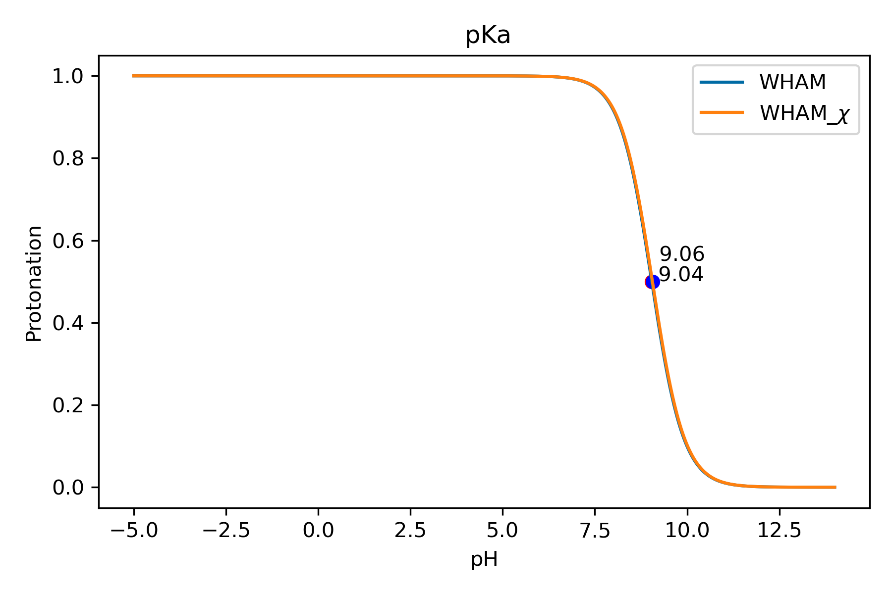

### Q17. How much is the pKa estimate affected by only considering the syn states? What if we only considered the anti population? 

# Conclusions

In summary, in this tutorial we have learned how to analyse data obtained from CpH-Metadynamics simulations in distinct points:

- how to compute free energies from the metadynamics bias potential for the chosen CVs;
- obtain reweighted properties for conformational data;
- how to manage protonation state data of titrable sites;
- how to compute reweighted average protonations and pKa estimates using a titration curve and the HH equation;
- how to estimate the errors using a block analysis and bootstrap approach;
- how to use a binless WHAM procedure to compute weights dependent on both the conformation and chemical information;
- Calculate protonation and conformational properties using these WHAM weights.  

Although some properties were shown to be pH-insensitive for the nucleoside, in macromolecular systems, this notebok is a good starting template to derive pH-related observables.
